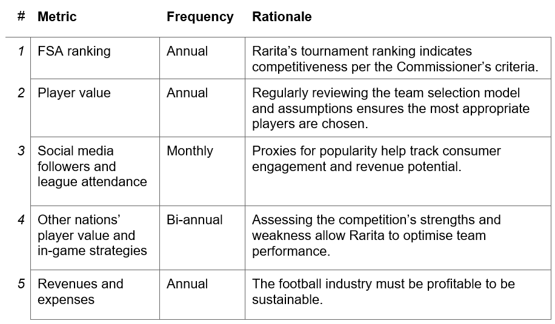
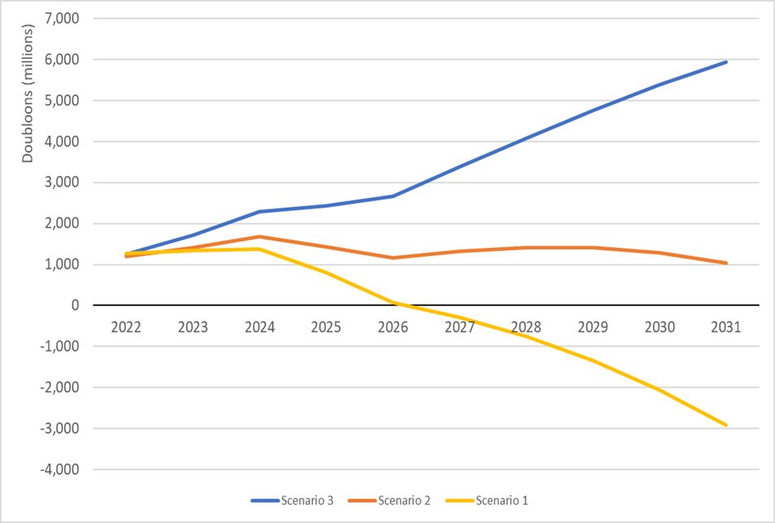
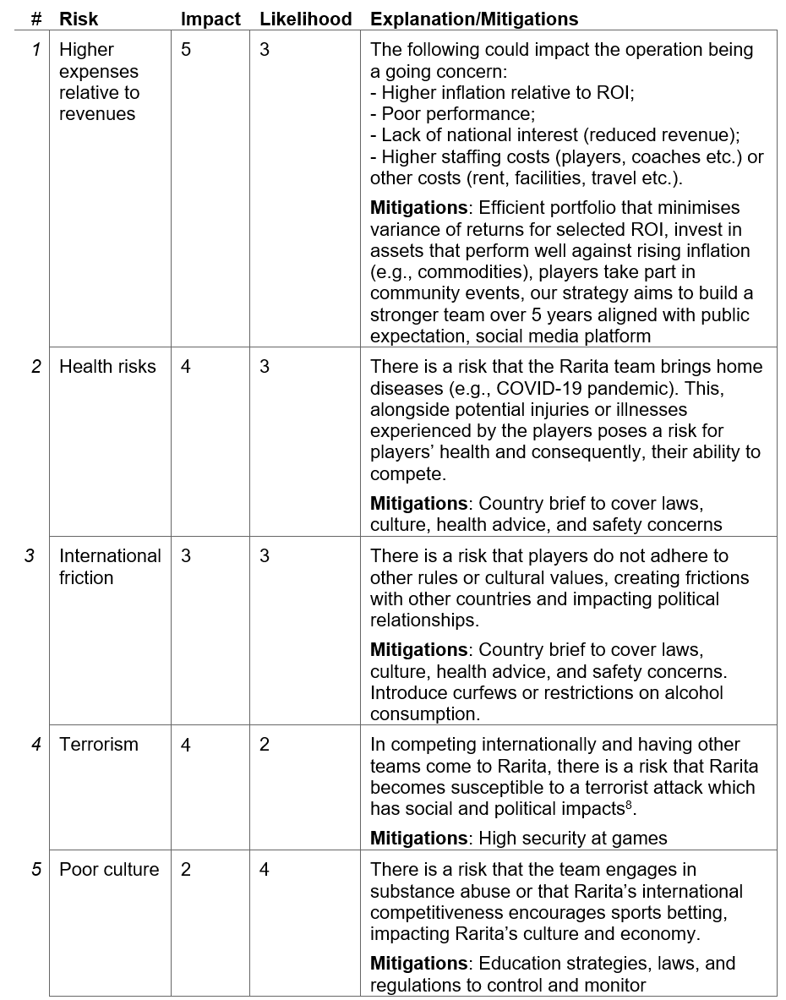

# SOA 2022 Challenge - Rarita FSA Selection 
#### The A Team

## Executive Summary

Rarita is looking to participate in the Football and Sporting Association (FSA) League. We are hired to:
*	Construct a competitive team; and
*	Analyse the impact of a Football brand on Rarita’s economy over the next 10 years.

In constructing a competitive team, below were the objectives:
*	Rarita ranking top ten of the FSA within the next five years; and
*	Rarita having a high probability of achieving a championship within the next 10 years.

The team selected for Rarita is comprised of 5 to 8 players for each position. The team will have a 99% probability of ranking within top 10 members of the FSA for the next 5 years and 95% of probability of placing in the top 3 within the next 10 years.
Over the 10 years, the investment of 995mil Doubloons allows Rarita to construct a competitive team without additional funding. While the venture is projected to remain profitable in most scenarios, consistent poor performance or a lack of consumer interest may result in lower revenue growth and create a going concern. 

## Team Selection

###	Steps
1.	Determined player's value based on playing statistics, position, and league (important indicator of the quality of opposition). 
2.	Maximised the total value of a team whilst constraining the total player salary, number of players in a position and proportion of allocated value for each position.
3.	Applied model to different salary caps to fit a polynomial equation linking salary and value.

.png)

4.	After establishing a strong link between underlying team value and performance, determined the probability of placing top 10 using team data from the 2021 tournament - probabilities were found by discounting the total team value back to 2021 at the superimposed inflation rate.

%20Value%20for%202021%20Tournament%20Teams%20vs%20Tournament%20Placing.png)

%2C%20Top%2010%20but%20Not%20Top%203%20(Top%2010)%20or%20Outside%20Top%2010%20(Bottom).png)

5. Minimised the net present value (NPV) of the total player salaries each year (includes return on investment and superimposed inflation), whilst meeting the competitiveness requirement.
6.	With the team budget for each year confirmed, players were selected.

A detailed description of the modelling strategy is contained [here](Model_steps.PNG).

### Qualitative Constraints

To meet the competitiveness requirement, regardless of return on investment (ROI) of unspent monies, increasing spending by an order of magnitude for two of the years (in the first 5 years) is required . However, large player budgets in 2025 and 2026 are ideal given other considerations. 

* Large player salaries early in the venture is not prudent because:
  * support structures for the team are yet to be tried and tested;
  * public typically have a low expectation of performance early in the venture, however, mediocre performance following success could reduce morale and support; and
  * three years of low spending enables early validation of the model and assumptions without exposing the venture to significant risk.

*	If the team proves successful in 2025 or 2026 it may garner strong national support and interest, inducing higher team investment from 2027-2031, and leading to a greater chance of future tournament success and further economic benefits.

### Results 

The anticipated spending on players for each year and the subsequent probabilities of placing are shown below:

%2C%20top%2010%20including%20Top%203%20(top%2010)%20or%20outside%20top%2010%20(bottom)%20for%20tournament%20position%20using%2012%25%20ROI.png)

The players chosen for the 2022 tournament are found [here](player_list_2022.PNG).

### Monitor
The folloing key matrics were used to monitor the strategy.

## Economic Impacts

### Scenarios

The following scenarios were used to determine the economic impact of creating an international Rarita soccer team:

1.No material impact (may occur if the team consistently underperforms, or if there is little consumer interest). 
* Revenues and expenses will grow in line with the historical average, defined as the 4-year geometric mean between 2016-2020 except for matchday revenues. 
* 2019-20 matchday data should be omitted to remove the effect of the COVID-19 pandemic which prevented live matches.
2.Moderate Impact
* Revenue growth will be double the historical average over the next 5 years.
* Aligns with Rarita’s goal to be a top 10 team within 5 years whereby a high-value team selected in years 2025-26 will succeed in placing in the top 10 to generate greater revenues through consistent public interest and sales.
3.High Impact
* Linear growth over the next 5 years up to the average revenues and expenses per capita recorded by the top 10 placing nations in 2020, before returning to the historical average growth.

### Assumptions

Across all scenarios, the following simplifying assumptions apply: 

*	Revenues and expenses grow uniformly throughout each province;
*	3.5% inflation in line with historical yearly averages (1991-2020);
*	12% ROI (per the team selection analysis); and
*	At the start of each year, return on invested assets are available and salaries are paid in full.

### Cash Flow

Below is a graph of the cash flow given each scenario:

The direct and indirect indicators can be found [here](economic_impacts.PNG).

### Risks

Below is a list of potential key risks resulting from the launch of the new team.

In relation to the risk of higher of expenses (risk 1), below is an analysis of the sensitivity impact (holding all other variables equal) for extreme ends of the variation range of key metrics under scenario 2.  

An assumption of 12% ROI is not required to maintain net profit over 10 years; an average ROI of 5% will ensure that a net profit is achieved. This target is reasonable in line with the S&P500 projected annualised return of 6% over the next 10 years.  A diversified portfolio may include real estate, which in the US has averaged 7.8% in 2016-21,   while bonds and options can relieve the underlying currency and liquidity risks.

Rarita should only be concerned when inflation exceeds 5%. The economic data provided illustrates that Rarita’s inflation has steadily decreased and was recorded as 1.32% in 2020 due to the COVID-19 pandemic. This relatively low inflation rate in 2020 is comparable to other countries, such as the US.  While inflation is expected to rebound globally for the next few years, Rarita’s inflation will likely settle on the historical average of 3.5%.

## Additional Information

The [full report](https://github.com/ACTL5100-T1-2022/github-showcase-page-the-a-team/blob/main/The%20A%20Team%20FSA%20Leagure%20Report%202022.docx) and accompanying annexes, [RMarkdown file](https://github.com/ACTL5100-T1-2022/github-showcase-page-the-a-team/blob/main/Annex%20A%20-%20Team%20Selection%20Code%20and%20Commentary.docx) for player selection and [spreadsheets](https://github.com/ACTL5100-T1-2022/github-showcase-page-the-a-team/blob/main/Annex%20B%20-%20Economic%20Impact%20and%20Sensitivity%20Analysis.xlsx) for economic analysis, are available for further information.

## References

Australian Sports Commission 2017, Intergenerational Review of Australian Sport 2017, Canberra
Choy, L 2022, Global M&A By the Numbers: 2021 Recap, accessed 14 March 202, < https://www.spglobal.com/marketintelligence/en/news-insights/blog/global-ma-by-the-numbers-2021-recap>
Damodaran Online 2022, Historical Returns on Stocks, Bonds and Bills: 1928-2021, accessed 16 March 2022, < https://pages.stern.nyu.edu/~adamodar/New_Home_Page/datafile/histretSP.html>
Frontier Economics 2010, The economic contribution of sport to Australia, accessed 16 March 2022, < https://www.clearinghouseforsport.gov.au/__data/assets/pdf_file/0005/855266/EconContribution_powerpoint.pdf>
Giraud, T 2014, ‘Did the 1998 FIFA World Cup in France have positive impacts on employment?’, accessed 13 March 2022 from DiVA Portal
U.S. Bureau of Labour Statistics 2022, Historical Consumer Price Index for All Urban Consumers, accessed 13 March 2022, < https://www.bls.gov/cpi/tables/supplemental-files/historical-cpi-u-202202.pdf>
Roberts, A., Roche, N., Jones, C. & Munday, M 2016, ‘What is the value of a Premier League football club to a regional economy?’: European Sport Management Quarterly, Vol 16, No 5, pp. 575-591, accessed 15 March 2022 from Taylor & Francis, DOI: 10.1080/16184742.2016.1188840
Toohey, K 2008, ‘Terrorism, sport and public policy in the risk society’, Sport in Society: Cultures, Commerce, Media, Politics, Vol 11, No 4, pp. 429-442, accessed 14 March 2022 from Taylor & Francis, DOI: 10.1080/17430430802019367
U.S. Bureau of Labour Statistics 2022, Historical Consumer Price Index for All Urban Consumers, accessed 13 March 2022, < https://www.bls.gov/cpi/tables/supplemental-files/historical-cpi-u-202202.pdf>
Weimar, D. & Wicker, P 2017, ‘Moneyball Revisited: Effort and Team Performance in Professional Soccer’: Journal of Sports Economics, Vol 18, No 2, pp. 140-161, accessed 14 March 2022 from Sage Journals Online , DOI: 10.1177/1527002514561789

